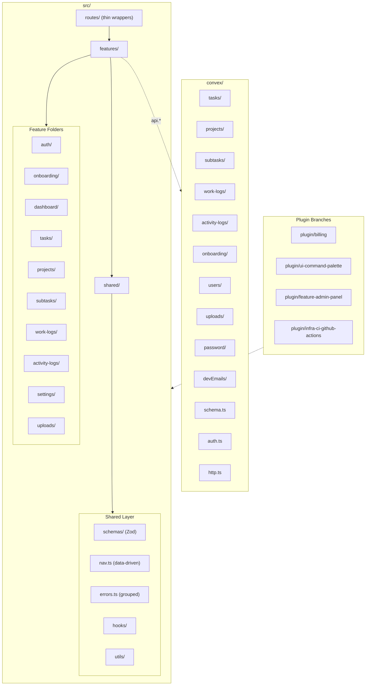

# Feather Starter (Convex)

A production-ready SaaS starter kit built with React 19, Convex, TanStack Router/Query/Form, Zod v4, Tailwind v4, and i18n. Feature-folder architecture with shared validation, YAML-driven code generators, git-branch plugin system, and 100% test coverage.

## Architecture



## Tech Stack

| Layer | Technology | Version |
|-------|-----------|---------|
| UI Framework | React | 19 |
| Backend | Convex | 1.32+ |
| Routing | TanStack Router | 1.166+ |
| Data Fetching | TanStack Query + @convex-dev/react-query | 5.90+ |
| Forms | TanStack Form | 1.28+ |
| Validation | Zod | 4.3+ (v4) |
| Styling | Tailwind CSS | 4.2+ |
| i18n | i18next + react-i18next | 23+ |
| Email | Resend + React Email | 6+ |
| Testing | Vitest + Testing Library + feather-testing-convex | 4+ |
| Generators | Plop.js (YAML-driven) | 4+ |

## Directory Structure

```
feather-starter-convex/
  convex/                    # Convex backend
    tasks/                   #   Task CRUD, visibility rules, assignment, reorder
    projects/                #   Project lifecycle, filtered views, task counts
    subtasks/                #   Subtask CRUD, promotion to tasks, reorder
    work-logs/               #   Time tracking entries on tasks
    activity-logs/           #   Auto-generated audit trail
    onboarding/              #   Username setup mutation
    uploads/                 #   File upload mutations
    users/                   #   User queries and mutations
    password/                #   Password reset email (Resend)
    devEmails/               #   Dev email capture (queries + mutations)
    email/                   #   React Email templates
    otp/                     #   OTP email sender (Resend)
    auth.ts                  #   Auth configuration
    schema.ts                #   Database schema
    http.ts                  #   HTTP routes
    test.setup.ts            #   Shared test fixture (createConvexTest)
  src/
    features/                # Feature folders
      auth/                  #   Login UI (email OTP, password, GitHub OAuth)
      dashboard/             #   Dashboard page, navigation shell
      onboarding/            #   Username setup page
      tasks/                 #   Task list, detail, forms, filtered views
      projects/              #   Project list, status lifecycle, task counts
      subtasks/              #   Subtask management within tasks
      work-logs/             #   Time tracking UI
      activity-logs/         #   Audit trail display
      settings/              #   Settings page (general tab)
      uploads/               #   File upload (embedded in settings)
    routes/                  # TanStack Router (thin wrappers)
      _app/_auth/dashboard/  #   Authenticated dashboard routes
      _app/login/            #   Public login route
    shared/                  # Cross-feature code
      schemas/               #   Zod schemas (tasks, projects, subtasks, work-logs, activity-logs, username)
      errors.ts              #   Feature-grouped error constants
      nav.ts                 #   Data-driven navigation items
      hooks/                 #   Shared React hooks
      utils/                 #   Utility functions
    ui/                      # shadcn/ui components
  templates/                 # Plop.js Handlebars templates + defaults.yaml
  scripts/                   # Setup and management scripts
    create.sh                #   One-command project creation
    setup.ts                 #   Interactive branding setup
    plugin.sh                #   Plugin management (list/preview/install)
  public/locales/            # i18n translation files (en/, es/)
```

## Features

### Auth
Email OTP, email + password, and GitHub OAuth login via `@convex-dev/auth`. The login page is a route-level component. Auth state is available throughout the app via `convex/users/queries.ts:getCurrentUser`.

### Onboarding
Post-signup username selection with Zod-validated input (max 20 chars). Frontend in `src/features/onboarding/`, backend in `convex/onboarding/`.

### Dashboard
Main authenticated area with data-driven navigation (tab bar from `src/shared/nav.ts`). The dashboard shell (`_layout.tsx`) wraps all authenticated routes.

### Tasks
Full task management with visibility rules (private vs shared/team pool), user assignment, status workflow (todo -> in_progress -> done), priority flags, and drag-reorder. Filtered views for "My Tasks" and "Team Pool". Backend in `convex/tasks/`.

### Projects
Project management with status lifecycle, filtered views, and automatic task counts. Tasks can be associated with a project. Backend in `convex/projects/`.

### Subtasks
Subtasks within tasks, with support for promotion to full tasks and drag-reorder. Backend in `convex/subtasks/`.

### Work Logs
Time tracking on tasks. Users can log time entries against tasks. Backend in `convex/work-logs/`.

### Activity Logs
Auto-generated audit trail that records changes across entities. Backend in `convex/activity-logs/`.

### Settings
User profile settings with avatar upload and username editing. Uses TanStack Form with Zod validation. Avatar uploads use `@xixixao/uploadstuff` with Convex storage.

### Uploads
File upload functionality using Convex's built-in storage. Currently embedded in the settings feature for avatar uploads. Backend mutations in `convex/uploads/mutations.ts`.

### Dev Mailbox
In the dev environment, all emails (OTP codes, password resets) are captured to a `devEmails` table and viewable at `/dev/mailbox`. No external email service needed for local development.

## Getting Started

### Prerequisites

- Node.js 18+
- npm
- A Convex account (free at [convex.dev](https://convex.dev))

### Quick Start (New Project)

Use the create script for one-command project setup:

```sh
bash scripts/create.sh
```

Then run the interactive branding setup to customize the project name, colors, and metadata:

```sh
npx tsx scripts/setup.ts
```

### Manual Setup

1. Install dependencies:
   ```sh
   npm install
   ```

2. Set up Convex:
   ```sh
   npx convex dev --once
   npx @convex-dev/auth
   ```
   > **Note:** Do not use `--configure=new` -- it overwrites `convex/tsconfig.json`, breaking path aliases ([upstream bug](https://github.com/get-convex/convex-js/issues/144)). If you already ran it, restore with `git restore convex/tsconfig.json`.

3. Configure environment variables in the Convex dashboard:
   ```sh
   # Email (Resend) -- required for OTP and password reset emails
   npx convex env set AUTH_RESEND_KEY re_...

   # GitHub OAuth (optional)
   npx convex env set AUTH_GITHUB_ID ...
   npx convex env set AUTH_GITHUB_SECRET ...
   ```

4. Start the dev server:
   ```sh
   npm start
   ```
   Opens at [http://localhost:5173](http://localhost:5173).

## Plugin System

Plugins are git branches that add features to the starter kit. Each plugin branch contains self-contained changes that merge cleanly into main.

### Available Plugins

| Plugin | Branch | What it adds |
|--------|--------|-------------|
| Billing | `plugin/billing` | Stripe subscription billing, checkout, plans, webhooks |
| Command Palette | `plugin/ui-command-palette` | Cmd+K command palette with cmdk, keyboard navigation, i18n |
| Admin Panel | `plugin/feature-admin-panel` | User management CRUD, role system, admin route guard |
| CI Workflows | `plugin/infra-ci-github-actions` | Auto-rebase on main push, CI checks on plugin branches |

### Plugin Management

```sh
# List available plugins
bash scripts/plugin.sh list

# Preview what a plugin changes
bash scripts/plugin.sh preview plugin/billing

# Install a plugin (merges into current branch)
bash scripts/plugin.sh install plugin/feature-admin-panel
```

### Creating a Plugin

1. Create a branch from main: `git checkout -b plugin/your-plugin-name`
2. Add your feature files in `src/features/your-feature/`
3. Add backend functions in `convex/your-feature/` if needed
4. Add i18n namespace in `src/i18n.ts` and translation files in `public/locales/`
5. Append to `src/shared/nav.ts` if adding navigation
6. Add error constants to `src/shared/errors.ts` if needed
7. Commit and push

Plugin extension points (append-only, minimal merge conflicts):
- `src/shared/nav.ts` -- navigation items array
- `src/shared/errors.ts` -- error constant groups
- `src/i18n.ts` -- namespace list

## Generators

Six CLI generators scaffold new code following project conventions. The feature generator reads from YAML spec files (`.gen.yaml`) to produce full CRUD features.

> **Scripted/CI usage:** All generators support non-interactive mode by passing arguments after `--`:
> ```sh
> npm run gen:feature -- --name my-feature
> npm run gen:schema -- --name my-feature
> npm run gen:backend -- --name my-feature
> npm run gen:frontend -- --name my-feature
> npm run gen:route -- --name analytics --authRequired
> npm run gen:convex-function -- --domain billing --type mutation --name createInvoice
> ```

### Feature Generator (YAML-Driven)

Reads a `.gen.yaml` spec file and scaffolds a full CRUD feature with frontend components, backend functions, tests, routes, i18n, and schema. See `src/features/tasks/tasks.gen.yaml` for a complete example spec.

```sh
npm run gen:feature
# Reads: src/features/{name}/{name}.gen.yaml
# Creates: components, hooks, tests, backend queries/mutations, route, translations
```

Generator defaults are configured in `templates/defaults.yaml`.

### Schema Generator

Generates a Zod schema from the `.gen.yaml` spec.

```sh
npm run gen:schema
# Creates: src/shared/schemas/{name}.ts
```

### Backend Generator

Generates Convex queries and mutations from the `.gen.yaml` spec.

```sh
npm run gen:backend
# Creates: convex/{name}/queries.ts, convex/{name}/mutations.ts
```

### Frontend Generator

Generates React components from the `.gen.yaml` spec.

```sh
npm run gen:frontend
# Creates: src/features/{name}/components/*.tsx, hooks, index.ts
```

### Route Generator

Creates a TanStack Router route file with optional auth guard.

```sh
npm run gen:route
# Prompts for: name (kebab-case), authRequired (y/n)
# Creates:
#   src/routes/_app/_auth/{name}.tsx  (if auth required)
#   src/routes/_app/{name}.tsx        (if public)
```

### Convex Function Generator

Generates a typed Convex query, mutation, or action.

```sh
npm run gen:convex-function
# Prompts for: domain, type (query/mutation/action), name
# Creates:
#   convex/{domain}/queries.ts   (or mutations.ts or actions.ts)
#   Skips if file already exists
```

## Shared Schemas

Zod v4 schemas in `src/shared/schemas/` are the single source of truth for validation, shared between frontend forms and Convex mutations.

| Schema | File | Purpose |
|--------|------|---------|
| Tasks | `schemas/tasks.ts` | Task creation/update validation |
| Projects | `schemas/projects.ts` | Project creation/update validation |
| Subtasks | `schemas/subtasks.ts` | Subtask creation/update validation |
| Work Logs | `schemas/work-logs.ts` | Work log entry validation |
| Activity Logs | `schemas/activity-logs.ts` | Activity log record validation |
| Username | `schemas/username.ts` | Username validation, `USERNAME_MAX_LENGTH` |

Convex mutations use `convex-helpers/server/zod4` (`zCustomMutation`, `zodToConvex`) to validate with the same Zod schemas.

## Internationalization

Translations live in `public/locales/{lang}/{namespace}.json`. Supported languages: English (`en`), Spanish (`es`).

Each feature has its own i18n namespace (e.g., `dashboard`, `tasks`, `projects`, `settings`). Components use `useTranslation("namespace")` to load translations.

To add a language: create new locale files in `public/locales/{lang}/` for each namespace.

## Testing

```sh
npm test              # Run all tests (with coverage)
npm run test:watch    # Watch mode
npm run test:e2e      # Playwright E2E tests
```

300+ tests across 35 test files with 100% coverage enforced. Pre-commit hooks (lefthook) run typecheck and full test suite -- commits are blocked if either fails.

Tests are co-located with their features (`*.test.tsx` / `*.test.ts`). Frontend tests use Testing Library with a custom `renderWithRouter` helper. Backend tests use `feather-testing-convex` which provides an in-memory Convex backend with typed `mutation`, `query`, and `auth` helpers.

Coverage excludes route files (thin wrappers) and barrel exports.

## Deployment

1. Build: `npm run build`
2. Deploy Convex: `npx convex deploy`
3. Deploy frontend to any static host (Vercel, Netlify, Cloudflare Pages)
4. Set `VITE_CONVEX_URL` in your hosting provider

## Vendor Documentation

See [PROVIDERS.md](./PROVIDERS.md) for detailed documentation on every external service, including swap guides for replacing any vendor.

## License

MIT
